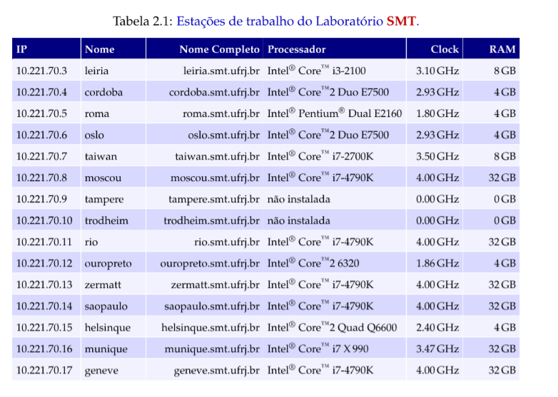
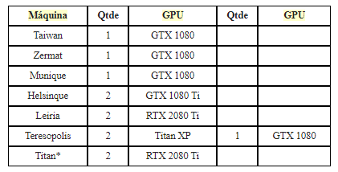

# Tutorial Jupyter notebook SMT

## Informações gerais

As informações sobre acesso e processamento nos clusters do smt podem ser encontradas [Aqui](https://smt.freshdesk.com/support/solutions/articles/23000006788-acesso-e-processamento-no-cluster-smt).


## Máquinas e IP's


## Máquinas com GPU:



# Pré-instalação para rodar notebooks (conda/miniconda)

Para instalar pacotes nas máquinas do smt, podemos utilizar o pip do usuário (pip --user) ou utilizar os ambientes do conda (acredito ser mais prático e funcional). Para isso, seguir o passo a passo:

Instalar o miniconda - Seguir a documentação:

[Miniconda - Conda documentation](https://docs.conda.io/en/latest/miniconda.html)

Ou copiar o arquivo desse link para o seu diretório remoto:

[https://repo.anaconda.com/miniconda/Miniconda3-latest-Linux-x86_64.sh](https://repo.anaconda.com/miniconda/Miniconda3-latest-Linux-x86_64.sh)

Rodar os seguintes comandos:

```bash
chmod 777 [Miniconda3-latest-Linux-x86_64.sh](https://repo.anaconda.com/miniconda/Miniconda3-latest-Linux-x86_64.sh) 
./[Miniconda3-latest-Linux-x86_64.sh](https://repo.anaconda.com/miniconda/Miniconda3-latest-Linux-x86_64.sh)
```

Criação do ambiente:

[Managing environments - conda 4.8.3.post9+1b994948 documentation](https://docs.conda.io/projects/conda/en/latest/user-guide/tasks/manage-environments.html)

Ou simplesmente:

```python
conda create -n myenv python=3.6
```

# Para rodar o notebook remotamente:

Primeiro, abrimos um túnel SSH para trazer a porta que irá rodar o notebook remotamente para o pc local:

```python
ssh -t -L localhost:8070:localhost:8070 user@loghost.smt.ufrj.br ssh -L localhost:8070:localhost:8070 user@maquina-alvo
#acessar a máquina 'maquina-alvo' pelo usuário 'user', redirecionando a porta 8070 da 
#'maquina-alvo' para localhost
```

Abrimos uma sessão com o screen para depois mantermos o processo rodando mesmo ao desconectar do terminal remoto:

```python
screen #Ctrl-A: comandos - Ctrl-D: detach - Ctrl-K: kill 
# para manter a sessão rodando mesmo quando desconectar, fazer a sequência:
# screen -> comandos para rodar o notebook -> Ctrl-A -> Ctrl-D
# screen -r //volta para a tela aberta anteriormente ou lista as telas abertas
# screen -r <numero da tela> //volta para a tela aberta
```

## Ativando o ambiente e rodando o notebook:

Obs.: Na primeira vez que conectar, o jupyter vai pedir o token de acesso que é gerado quando rodamos o comando abaixo, sendo necessário copiar o fim da URL que estará na cli da máquina remota (?token='copiar-o-que-tá-aqui'):

```python
conda activate env
jupyter notebook --no-browser --port=8070
#rodando o notebook no ambiente 'env'
```

Depois do notebook subir na máquina remota, basta acessar pelo seu browser local o endereço localhost:8070. Se o seu terminal local aceitar (recomendo usar o WSL + Windows Terminal se estiver no windows), é possivel acessar o endereço já com o token com ctrl + clique na mensagem que o jupyter escreve na máquina remota.

## Liberar porta presa para reuso

Algumas vezes o processo do jupyter notebook não é encerrado corretamente e a porta fica presa, precisando fazer o seguinte procedimento para rodar novamente o notebook naquela porta:

```python
netstat -lpn |grep :8070 # ver o pid que tá usando a porta 8070
kill <pid> # matar o processo com o pid visto acima
```